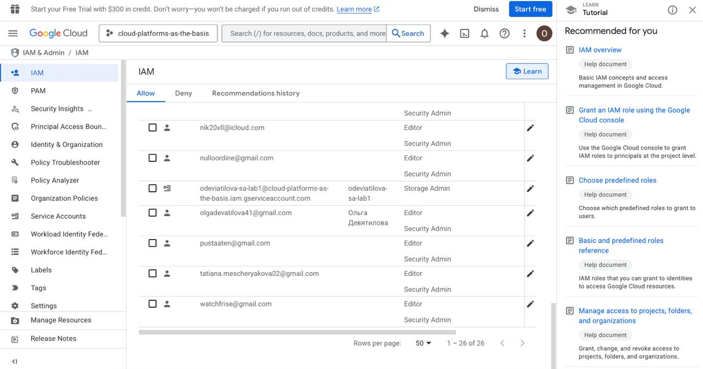
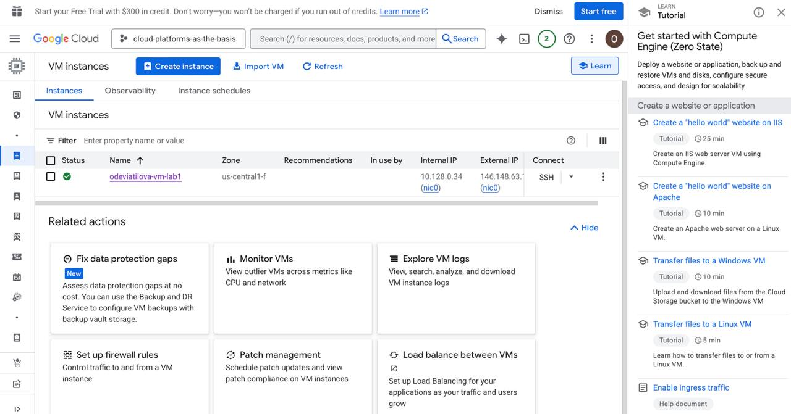
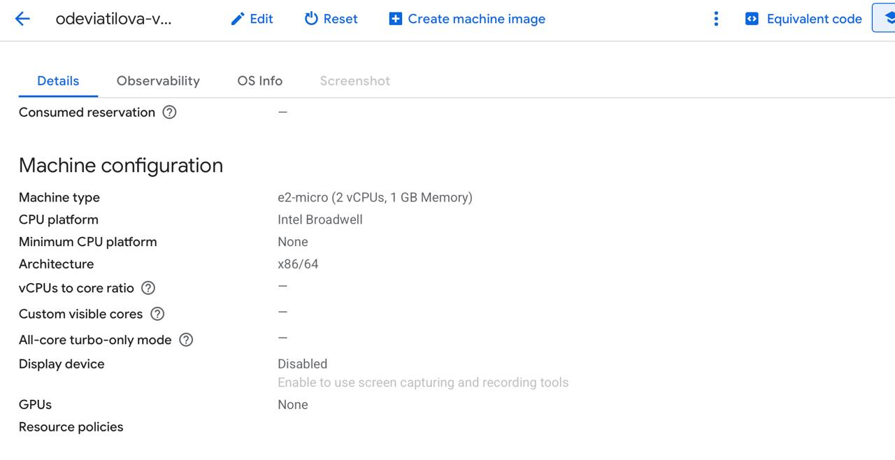
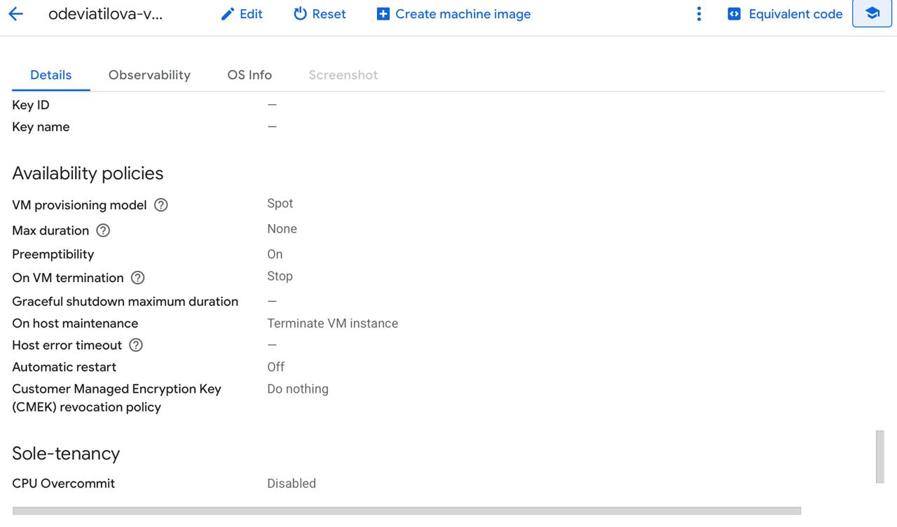
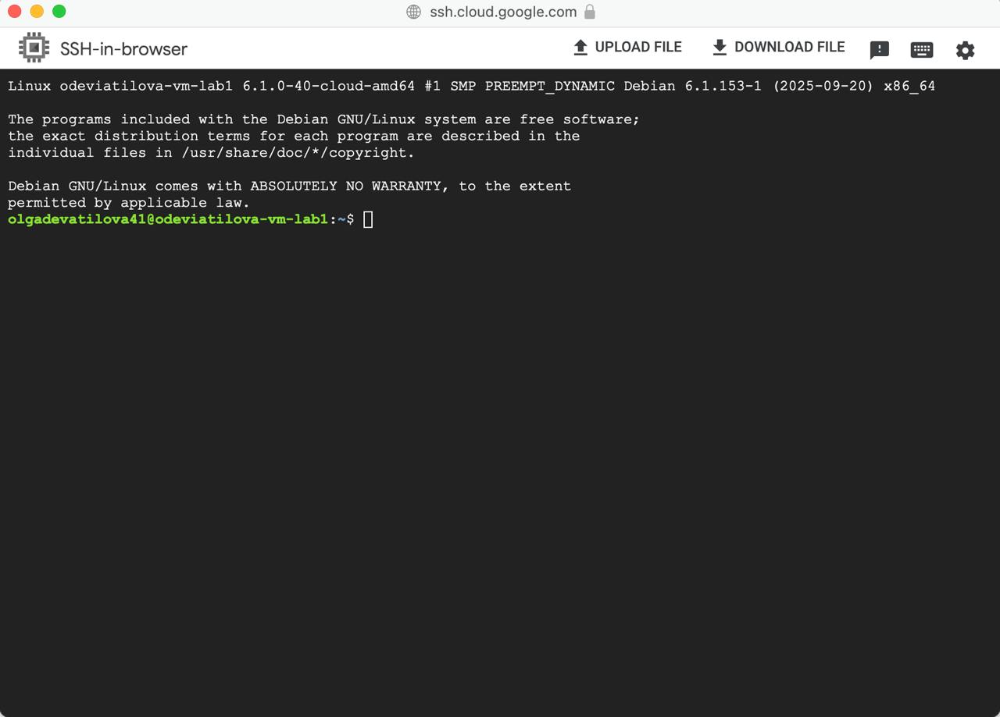
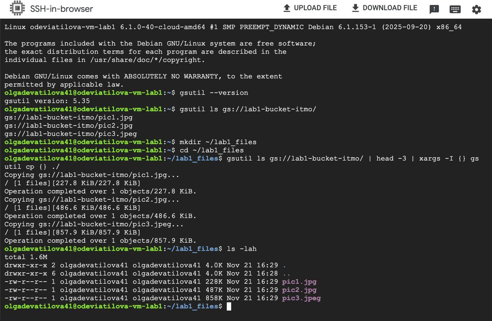
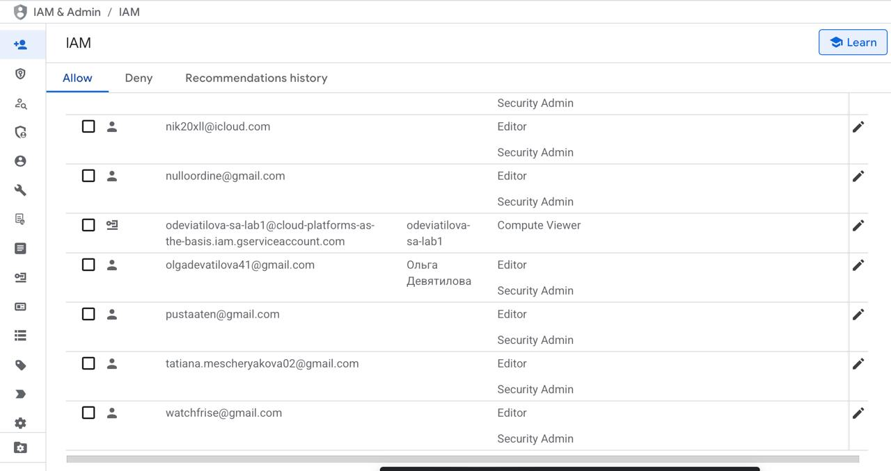
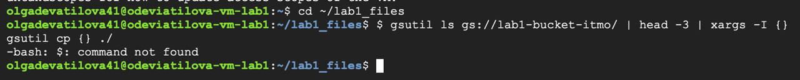
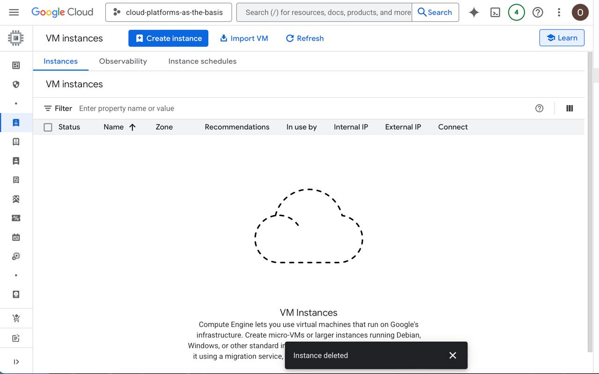
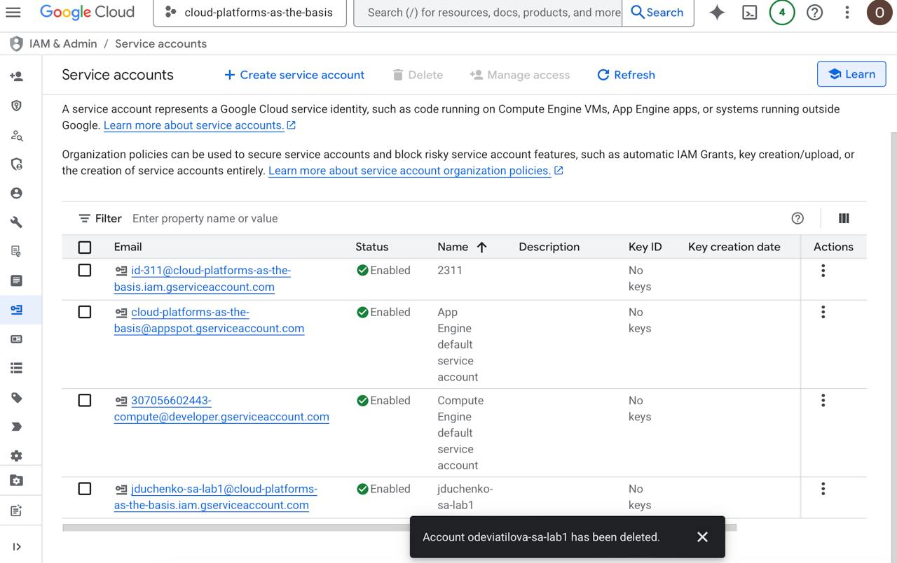

University: [ITMO University](https://itmo.ru/ru/)
Faculty: [FICT](https://fict.itmo.ru)
Course: [Cloud platforms as the basis of technology entrepreneurship](https://) ADD link
Year: 2025/2026
Group: U4125
Author: Deviatilova Olga
Lab: Lab1
Date of create: 22.11.2025
Date of finished: 24.11.2025

# Лабораторная работа №1

Первые шаги были подробно объяснены во время практического занятия.

## 1. Создала service account с ролью Storage Admin

## 2. Создала минимальный compute engine (виртуальную машину) с Machine type e2-micro в режиме spot

## 3. Затем самостоятельно изучила утилиту gsutils, скопировала файлы из lab1-bucket-itmo в локальную папку на VM и с помощью команды ls -lah отобразила, что эти файлы есть на VM.

## 4. Поменяла права доступа для service account на Compute Viewer

## 5. Повторила пункт с копированием данных, но прав уже недостаточно, поэтому копировать не получилось

## 6. Напоследок удалила все созданные сервисы

