University: [ITMO University](https://itmo.ru/ru/)
Faculty: [FICT](https://fict.itmo.ru)
Course: [Cloud platforms as the basis of technology entrepreneurship](https://) ADD link
Year: 2025/2026
Group: U4125
Author: Deviatilova Olga
Lab: Lab2
Date of create: 22.11.2025
Date of finished: 24.11.2025

# Лабораторная работа №2

## 1. Создала Cloud Run контейнер с именем hello-service

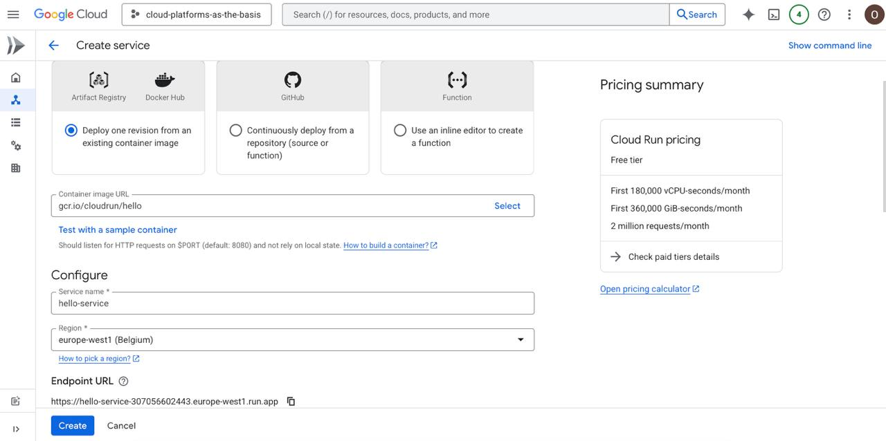

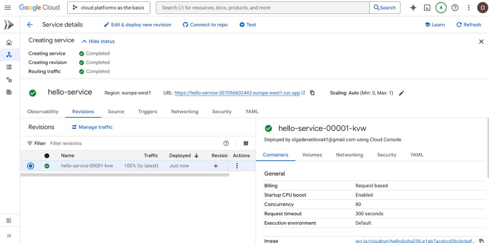

## 2. Протестировала сервис в браузере

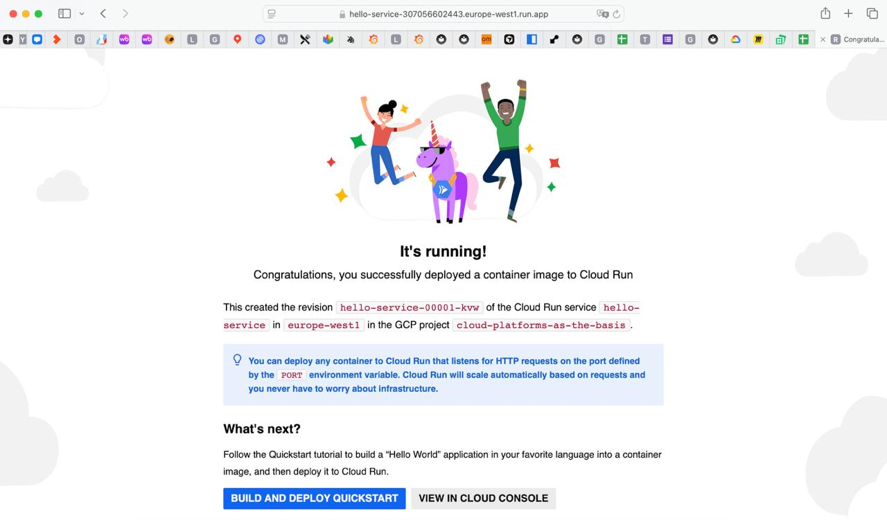

## 3. Посмотрела логи и метрики, увидела, что контейнер запускается, ошибок нет

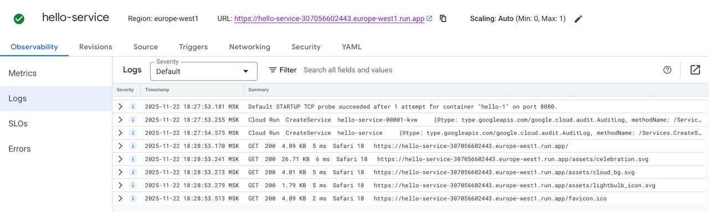

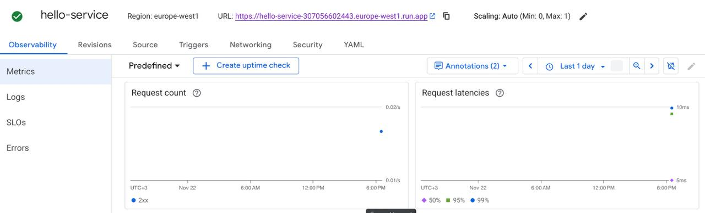

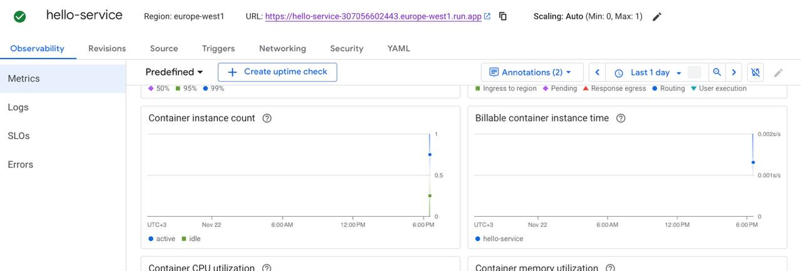

## 4. Затем создала новую версию и изменила порт на 8090

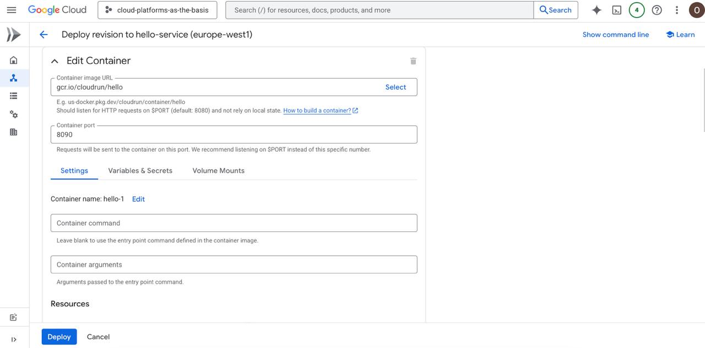

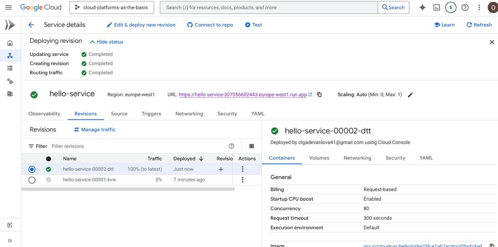

## 5. После проверила работу и выдалась ошибка

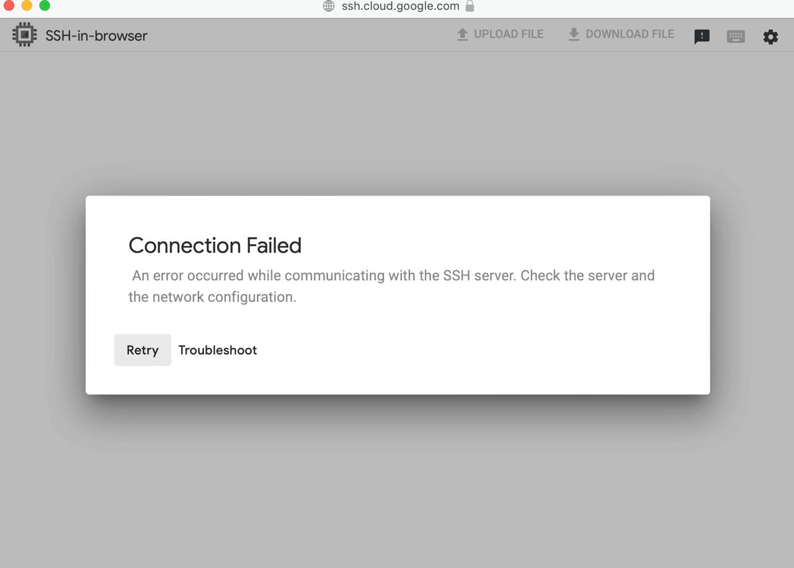

## 6. Задала переключение трафика
Решила сделать распределение 50/50 между первой и второй версиями, в результате чего, если открывался запрос через первый - то все шло успешно, а через второй - с ошибкой.

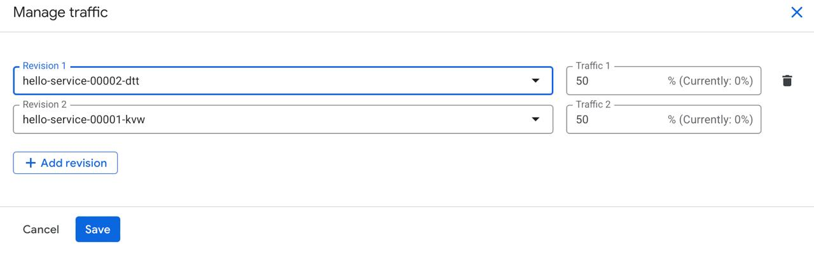

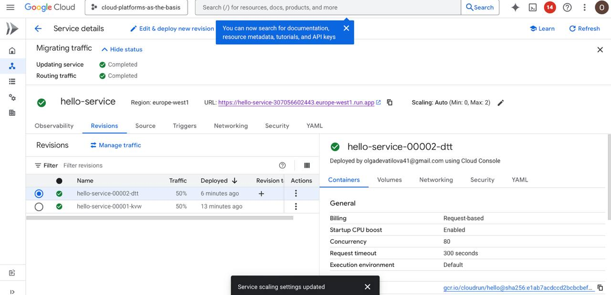

## 7. Удаление созданного сервиса

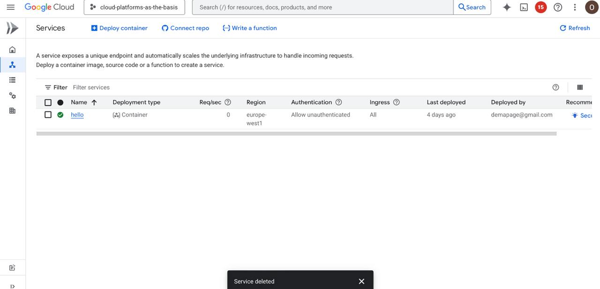
