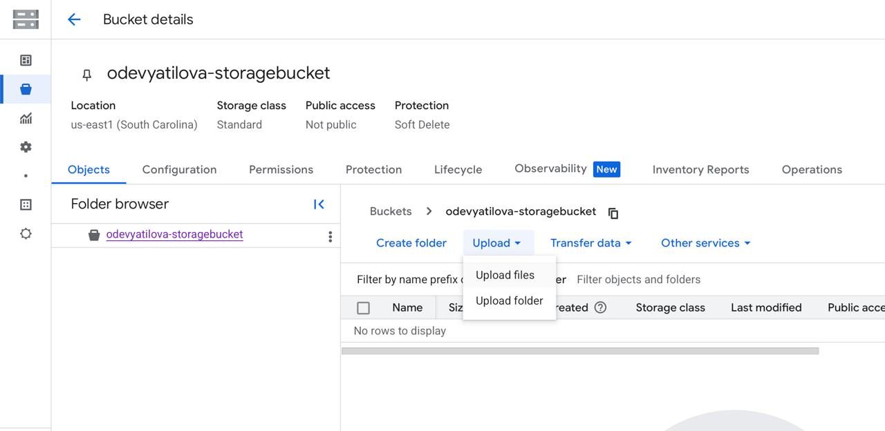
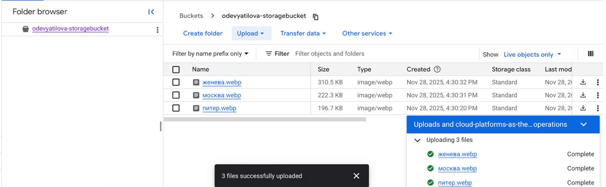
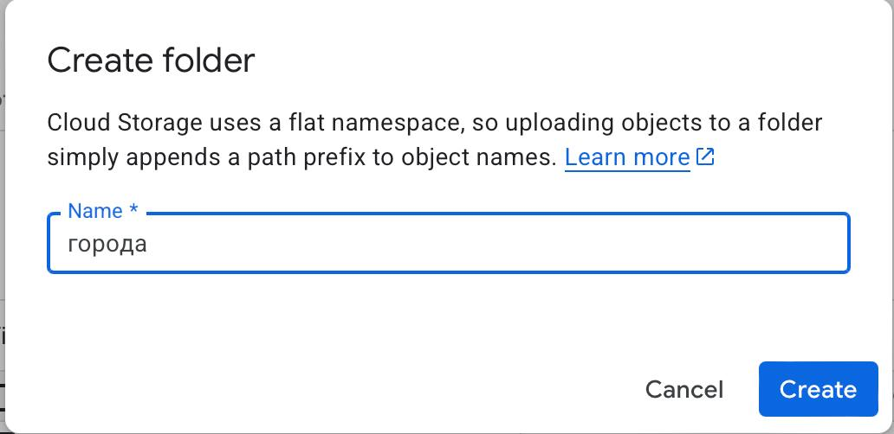
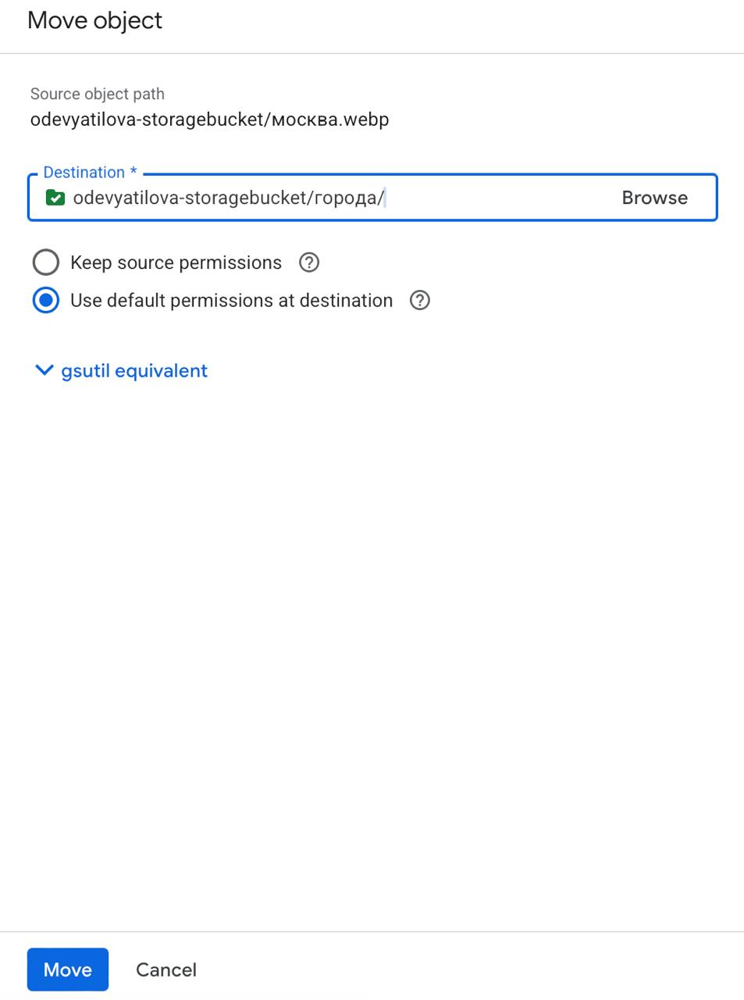
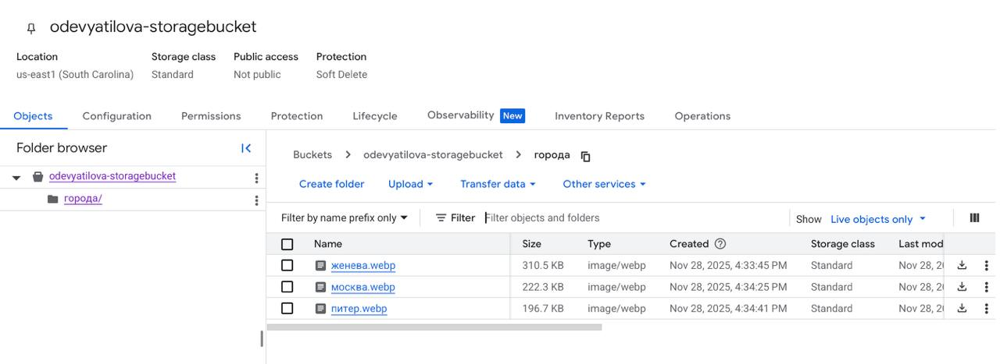
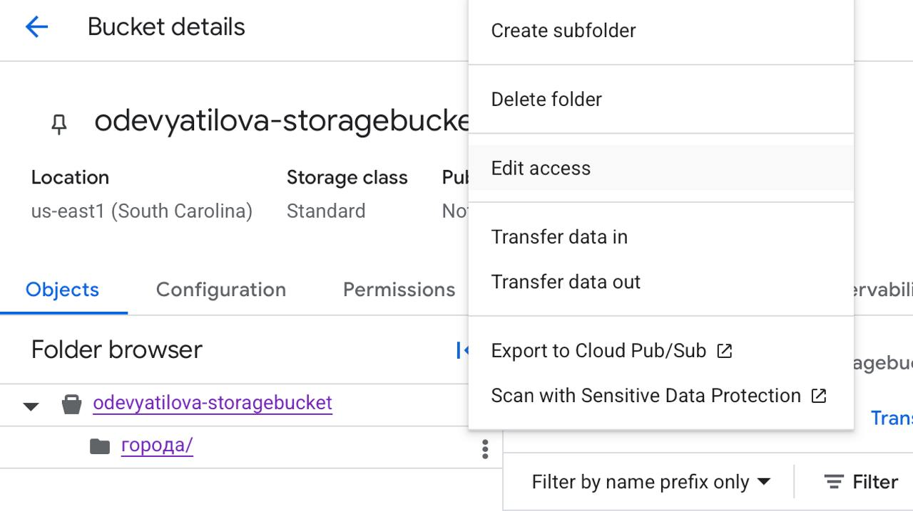
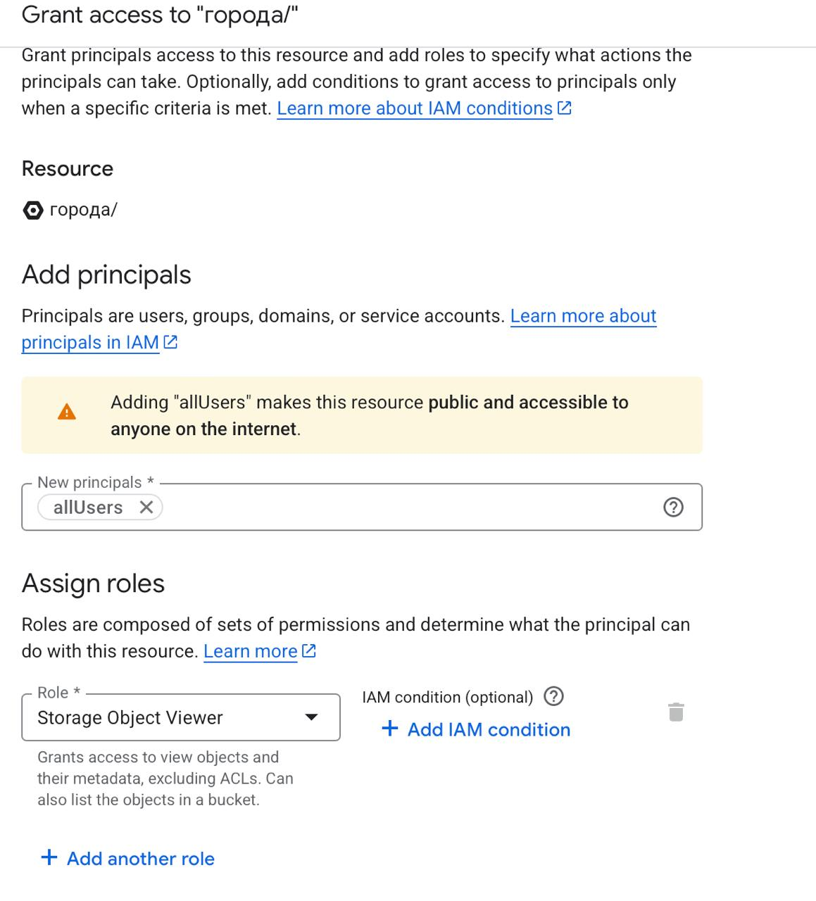

University: [ITMO University](https://itmo.ru/ru/)
Faculty: [FICT](https://fict.itmo.ru)
Course: [Cloud platforms as the basis of technology entrepreneurship](https://) ADD link
Year: 2025/2026
Group: U4125
Author: Deviatilova Olga
Lab: Lab3
Date of create: 25.11.2025
Date of finished: 28.11.2025

# Лабораторная работа №3

## 1. Создала Cloud Storage bucket

## 2. Загрузила изображения через Upload files в свой bucket

## 3. Создала папку "города"

## 4. Затем переместила файлы фотографий в папку "города"

## 5. Изменила доступ к папке через Permission и Edit access на публичный

## 6. Скопировала ссылки публичного доступа к загруженным файлам фотографий.
Прилагаю их:

[фото_женева](https://storage.googleapis.com/odevyatilova-storagebucket/%D0%B3%D0%BE%D1%80%D0%BE%D0%B4%D0%B0/%D0%B6%D0%B5%D0%BD%D0%B5%D0%B2%D0%B0.webp)

[фото_москва](https://storage.googleapis.com/odevyatilova-storagebucket/%D0%B3%D0%BE%D1%80%D0%BE%D0%B4%D0%B0/%D0%BC%D0%BE%D1%81%D0%BA%D0%B2%D0%B0.webp)

[фото_питер](https://storage.googleapis.com/odevyatilova-storagebucket/%D0%B3%D0%BE%D1%80%D0%BE%D0%B4%D0%B0/%D0%BF%D0%B8%D1%82%D0%B5%D1%80.webp)

Не удаляла созданные сервисы, чтобы была возможность проверить работу ссылок при сдаче лабораторной работы.
После сдачи все удалю.
