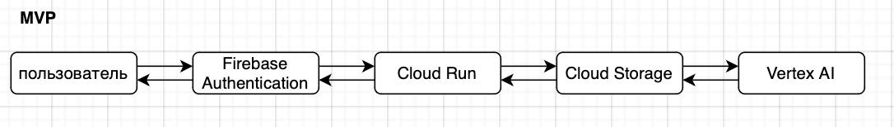
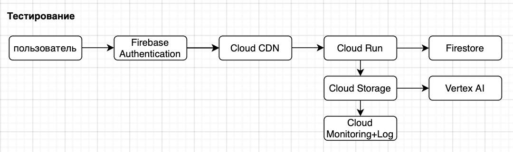
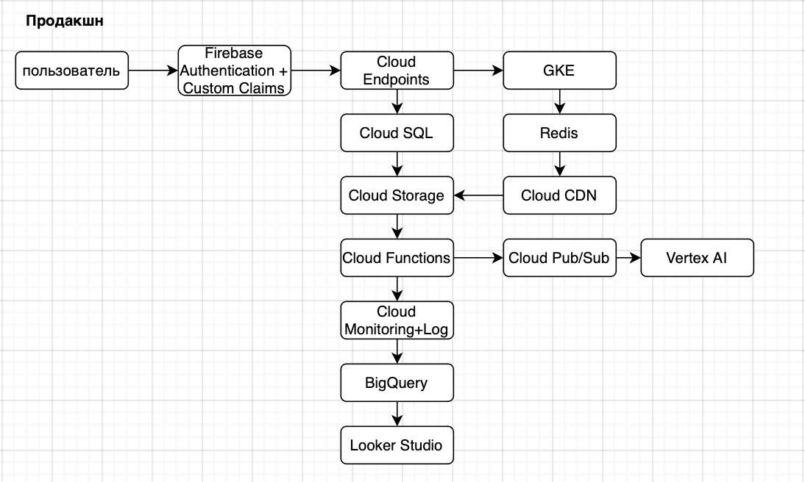

University: [ITMO University](https://itmo.ru/ru/)
Faculty: [FICT](https://fict.itmo.ru)
Course: [Cloud platforms as the basis of technology entrepreneurship](https://) ADD link
Year: 2025/2026
Group: U4125
Author: Deviatilova Olga
Lab: Lab4
Date of create: 29.11.2025
Date of finished: 01.12.2025

# Лабораторная работа №4

## Описание приложения «Генератор рецептов»:

Пользователь пишет список продуктов, которые у него есть в наличии, и получает подборку рецептов с пошаговой инструкцией по приготовлению.

## 1. MVP (до 10 пользователей)

Рабочий продукт при минимальных затратах.

### Общая схема:

1. Фронтенд (веб интерфейс).
2. Бэкенд сервер (обработка запросов, бизнес логика).
3. База данных (хранение рецептов и пользовательских данных).
4. ИИ модуль (генерация рецептов на основе списка продуктов).

### Описание:

1. Фронтенд 
Google Cloud Storage 
Функции:
- форма ввода списка продуктов;
- отображение сгенерированного рецепта (название, ингредиенты, пошаговая инструкция, фото);
- простая авторизация (email/пароль);
- история запросов (для авторизованных пользователей).
2. Бэкенд 
Google Cloud Run 
Функции:
- приём HTTP запросов от фронтенда;
- валидация входных данных;
- передача списка продуктов в ИИ модуль;
- сохранение истории запросов в БД;
- выдача ответа клиенту в формате JSON.
3. ИИ модуль
Vertex AI 
Предобученная модель:
- Открытая модель + база рецептов
- ИИ выбирает подходящий рецепт из базы по совпадению ингредиентов.
4. Интеграции и сервисы
Аутентификация: Firebase Authentication

### Экономическая модель

| Сервис | Стоимость/месяц |
|------|----------------|
| Cloud Run | $5,00 |
| Cloud Storage | $0,02 |
| Vertex AI | $3,00 |
| Firebase Authentication | $0,00 |
| **Итого** | **$8,02** |

Самые дешевые ресурсы, платим за запросы ИИ

## Тестирование (50–1000 пользователей)

Тестирование с партнерами.

### Описание:

1. Фронтенд
Cloud CDN + Cloud Storage 
- CDN ускорит загрузку
2. Бэкенд 
Cloud Run 
3. База данных
Firestore
4. ИИ модуль
Vertex AI 
5. Интеграции и сервисы
- Аутентификация: Firebase Authentication
- Мониторинг: Cloud Monitoring 
- Логирование: Cloud Logging 

### Экономическая модель

Сервис |	Стоимость/месяц
|------|-----------------|
Cloud Run | $4,50
Firestore | $3,00
Cloud Storage + CDN | $12,50
Vertex AI | $22,50
Firebase Authentication | $0,00
Cloud Monitoring + Logging | $1,20
**Итого** | **$41,70**

Появляется CDN, больше запросов к ИИ, мониторинг и логи

## Продакшн (1 000+ пользователей)

Высокая доступность, низкая задержка, кэширование, аналитика.

### Описание:

1. Фронтенд
Cloud CDN + Cloud Storage
2. Бэкенд
Google Kubernetes Engine (GKE)
3. База данных
Cloud SQL (PostgreSQL)
4. ИИ модуль
Vertex AI
5. Кеширование и очереди
Cloud Memorystore for Redis
Cloud Pub/Sub + Cloud Functions
6. Интеграции и сервисы
- Аутентификация: Firebase Authentication + Custom Claims (роли: пользователь, модератор, админ)
- Хранение: Cloud Storage + CDN
- Мониторинг: Cloud Monitoring 
- Логирование: Cloud Logging + BigQuery (анализ поведения пользователей)
- API шлюз:  Cloud Endpoints (аналитики API запросов, защиты от DDoS)
- Аналитика: Looker Studio (дашборды)

### Экономическая модель

Сервис |	Стоимость/месяц
|------|-----------------|
GKE | $180,00
Cloud SQL | $96,00
Cloud Memorystore (Redis) | $30,00
Cloud Storage + CDN | $85,00
Vertex AI | $150,00
Cloud Pub/Sub + Functions | $5,00
Firebase Authentication | $25,00
Cloud Endpoints | $45,00
Cloud Monitoring + Logging + BigQuery | $35,00
Looker Studio | $10,00
**Итого** | **$661,00**

Появляются SQL, Pub/Sub, Redis, большая аналитика

